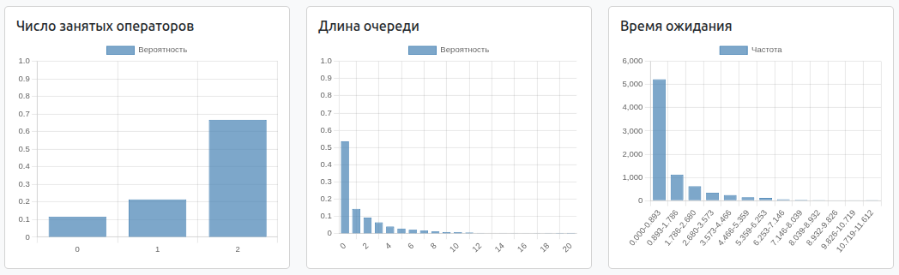
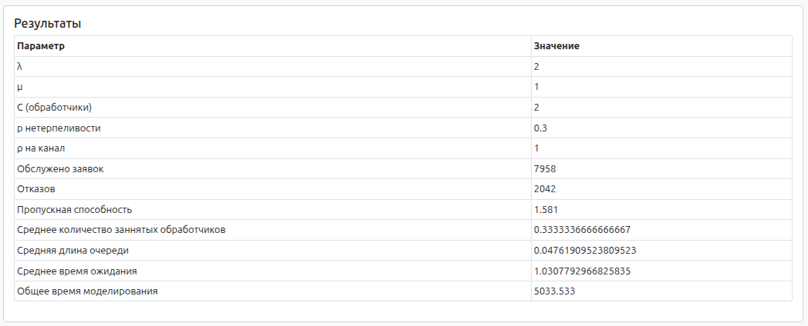

### Система массового обслуживания M/M/* с усложнениями

Реализовать систему M/M/* с **двумя дополнительными правилами** (ООП).

**Возможные усложнения:**
- ограничение числа приборов (вероятность отказа);
- очередь;
- нетерпеливость заявок;
- требования к ресурсам (детерминированные или случайные).
- GUI или подробное логирование и вывод результатов работы в отдельный файл

### Решение

## Система массового обслуживания M/M/n/∞ с усложнениями

Реализация системы M/M/n с двумя дополнительными правилами:
1. **Очередь неограниченной длины**
2. **Нетерпеливые заявки** - С некоторой вероятностью, если нет свободных операторов, заявка уходит

---

### Усложнение 1: Очередь неограниченной длины

Если нет свободных приборов для обслуживания заявки, то она попадает в очередь. По мере обслуживания, заявка продвигается по очереди до момента обслуживания прибором.

### Усложнение 2: Нетерпеливые заявки

Каждая заявка, при отсутствии свободных приборов, может не поступить в очередь, а просто отклониться. Имитация нетерпеливых клиентов, нежелающих стоять в очереди.

---

## Пример работы программы

### Ввод параметоров

### Гистограммы

### Эмперические расчеты

